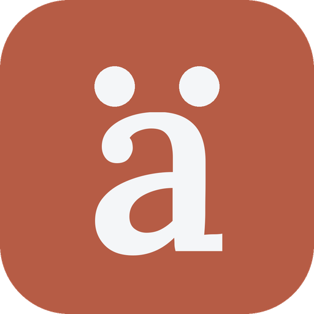
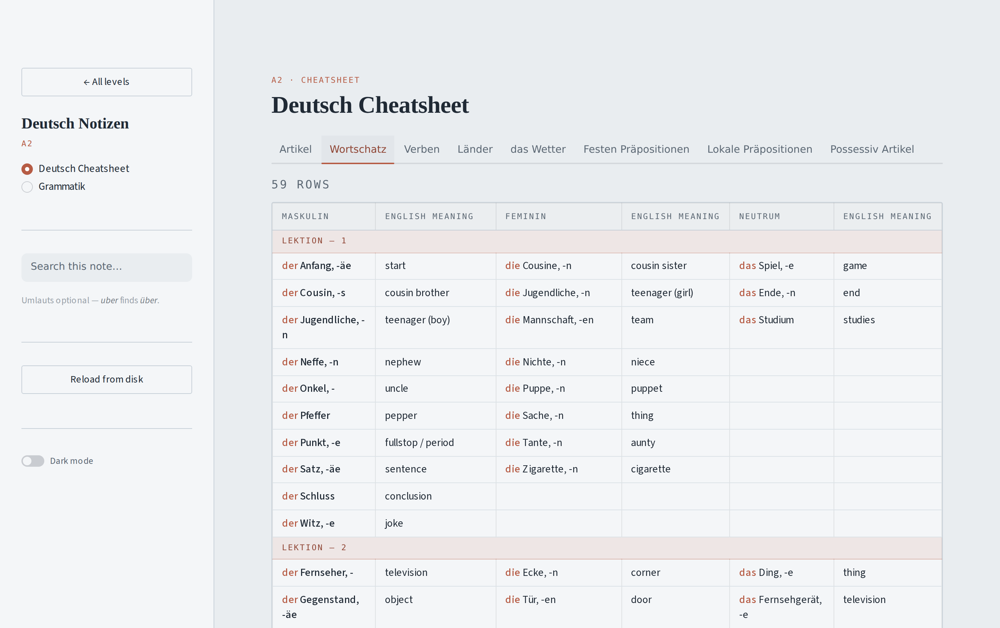
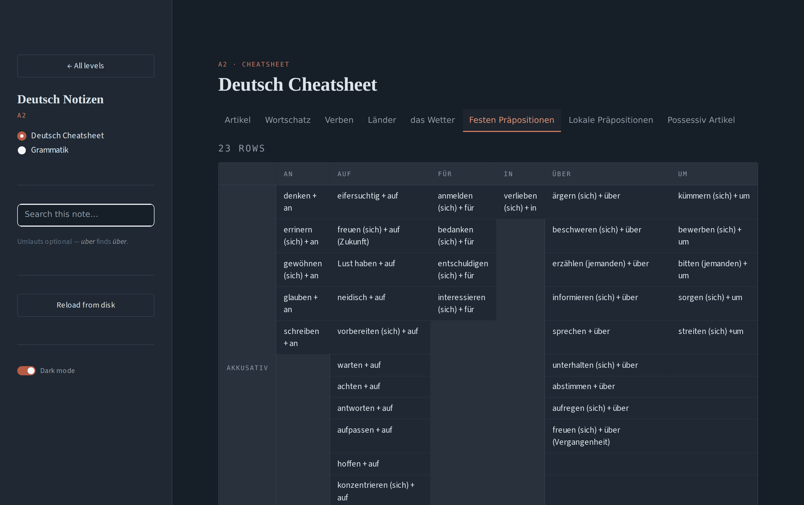

# Deutsch Notizen

<br clear="left">

A reader for my German notes. I keep the notes themselves in LibreOffice —
a cheatsheet and a grammar document per level — and this app reads those files
directly, so the notes stay the source of truth and the app is just a nicer way
to look at them. Nothing is exported, converted, or copied into a database.

Pick a level on the front page, then a note. Cheatsheets open as tabs, one per
sheet. Grammar documents read straight down the page.



<details>
<summary>Dark mode</summary>



</details>

---

## Run it locally

Requires Python 3.10 or newer.

```bash
git clone https://github.com/<you>/deutsch-notizen.git
cd deutsch-notizen

python -m venv .venv
source .venv/bin/activate        # Windows: .\.venv\Scripts\Activate.ps1

pip install -r requirements.txt
streamlit run app.py
```

It opens at `http://localhost:8501`.

The only dependency is Streamlit. The OpenDocument parsing is written against
the standard library — `.ods` and `.odt` files are ZIP archives containing an
XML document, and `notizen_app/readers/odf.py` reads them with `zipfile` and
`xml.etree`. The `[pdf]` extra in `requirements.txt` pulls in the viewer
component used to read books in the page; without it, downloads still work and
the embed falls back to a short note.

---

## Adding notes

Drop `.ods`, `.odt` or `.pdf` files into `notizen/`. The filename is the
metadata — `<Level>_<Title>`, with underscores or spaces, either works:

```
notizen/
  A2 Deutsch Cheatsheet.ods    ->  A2 · Deutsch Cheatsheet
  A2 Grammatik.odt             ->  A2 · Grammatik
  B1 Wortschatz Extra.ods      ->  B1 · Wortschatz Extra
  C1 Konjunktiv.odt            ->  C1 · Konjunktiv
```

Levels A1–C2 each get a card on the front page, in order. Anything that doesn't
start with a level code lands under **Sonstige**. Adding a level needs no code
change — the card appears on its own.

After editing a note, save in LibreOffice and press **Reload from disk** in the
sidebar. Close the file in LibreOffice before committing, or you'll have a
`.~lock` file sitting next to it (already excluded in `.gitignore`).

---

## How the notes are read

### Cheatsheets (`.ods`)

One tab per sheet. A sheet is rarely one clean table — it's usually several,
laid out side by side or stacked, separated by blank rows and columns. Those get
reconstructed:

| In the sheet | In the app |
| --- | --- |
| 2+ blank columns | separate tables, side by side becomes stacked |
| 2+ blank rows | a new table below |
| a single blank row or column | kept as spacing |
| a row with one filled cell (`Lektion – 1`) | a band across the table |
| a row whose filled cells are mostly bold | a header — the table splits here |
| a bold cell merged down the side (`Akkusativ`) | a label column, not a header cell |
| the first full row of a block | its header, repeated on later tables of the same width |

Bold is what marks a header, which is why stacking `Akkusativ` over `Dativ` in
one grid produces two tables, each under its own headings, and why each `Teil`
of Lokale Präpositionen repeats the column headings instead of losing them off
the top of a long scroll.

*Mostly* bold, not entirely — a column added to a sheet later often misses the
formatting of the ones beside it. Half the filled cells is the bar, which stays
clear of a data row carrying one bold label down its side: `Bestimmt` in Artikel
and `Maskulin` in das Wetter run nearer a third, so those tables stay whole. If
a sheet is bold throughout, the signal means nothing and is ignored rather than
turning every row into its own table.

Merged cells are tracked against a grid rather than trusting each cell's own
flag, because splitting a table can leave a cell whose merge lived in the half
that went elsewhere. Those hold their column instead of collapsing — which is
what keeps merged blank regions from shifting every row left by one.

### Grammar documents (`.odt`)

Headings, paragraphs, lists and tables in document order, with bold and italic
preserved.

Numbered and bulleted lists keep their own markers, and nesting is preserved.
LibreOffice splits one visual list into several `<text:list>` elements whenever
the indent level changes, so those are stitched back together — which is also
what makes numbering run 1..n rather than restarting at each example sentence.
An indented sub-item renders as a Beispielsatz: italic, quieter, hung off a rule
in the accent colour.

Calc tables embedded in a Writer document — the `Beispiel Sätze` table in
`A2 Grammatik.odt` — are pulled out of the nested object and rendered as real
tables, not images.

### Books (`.pdf`)

Treated as books rather than notes: there is nothing useful to re-render in a
scanned textbook. A book gets a download button and reads inline in the page.
Books sort after notes in the sidebar and are marked `· PDF`. Search doesn't
apply to them, so that box hides while one is open. Anything over 25 MB asks for
a click before its bytes are read, so a large scan isn't pulled into memory on
every rerun.

**No PDFs are included in this repository.** Course textbooks are copyrighted by
their publisher, and a public repo or a public deployment is redistribution.
`.gitignore` excludes `notizen/*.pdf` so they can't be committed by accident.
The feature works locally — drop a PDF into `notizen/` and it appears — but the
files stay on the machine that owns them.

Two practical limits point the same way: GitHub rejects any file over 100 MB and
warns above 50 MB, and a hosted deploy pulls the whole repo each time, so a few
hundred megabytes of scans makes deploys slow and can exhaust a free tier's
memory.

---

## Reading aids

**Search ignores umlauts.** `uber` finds `über`, `gruss` finds `Gruß` — nothing
has to be typed on a German keyboard layout. In a cheatsheet it searches every
sheet at once and keeps the `Lektion` band above each hit, so results stay in
context; merged labels like `Dativ` are carried onto the first surviving row, so
a match never appears without the case it belongs to. In a grammar document it
keeps the rule above any example sentence that matches.

**Two tints that carry meaning.** The article is tinted in vocabulary entries
(`der Anfang`) and the perfect auxiliary is muted (`hat aufgemacht`) — gender
and haben/sein being the two things a list like that exists to drill. Two guards
keep it quiet: the entry must be lowercase, so a sentence starting "Das…" is
left alone, and a word must follow, so the Artikel declension table — whose
cells *are* the articles — stays plain.

**Dark mode** toggles in the sidebar. It's the same three colours seen from the
other end: the light mode's text colour becomes the dark surface, and the accent
is lifted so it still carries on a dark ground.

---

## Deploying

The app reads whatever files are in the repo at the deployed commit, so a note
edited locally doesn't change the live app until it's committed and pushed.

On [Streamlit Community Cloud](https://share.streamlit.io): **New app** → pick
the repo, branch `main`, main file `app.py`. It installs from
`requirements.txt`. Pushes to `main` redeploy automatically.

**Pin the Streamlit version before deploying.** `theme.py` styles some of
Streamlit's own widgets through their DOM hooks, and those change between
releases — tabs moved from BaseWeb to react-aria in 1.61, which silently broke
the old tab rules without any error. Replace the range in `requirements.txt`
with the version you tested against:

```bash
pip freeze | grep "^streamlit"
```

If a later upgrade does make a widget look wrong, the tab rules in `theme.py`
show the pattern: cover both the old and new hooks, and use `!important`, since
Streamlit injects its own styles after this stylesheet.

---

## Layout

```
app.py                     screens and routing
assets/                    app icon (also the browser favicon)
notizen/                   the notes themselves — the app's only data source
notizen_app/
  library.py               finds files, reads level and title from the name
  layout.py                recovers table structure from a sheet
  render.py                HTML, search, highlighting
  theme.py                 light and dark palettes, all CSS
  readers/odf.py           OpenDocument parser (zipfile + ElementTree)
.streamlit/config.toml     Streamlit's own theme colours
requirements.txt
```

Palette: background `#E9EDF0`, text `#202A35`, accent `#B65C45`. The dark mode
is derived from the same three in `theme.py`. Type: Newsreader for headings,
IBM Plex Sans for text, IBM Plex Mono for labels.

The icon is an **ä** on the accent colour — the umlaut being the most
recognisable thing in German typography, and two dots over a bowl holding a
distinct silhouette down to 16px where a drawn object would turn to mush. It is
`assets/icon.png`, passed to `page_icon`, so it doubles as the browser favicon;
`assets/favicon.ico` is there for hosting anywhere that wants a real `.ico`.

---

## Notes

Personal project — the notes in `notizen/` are my own coursework, and any
mistakes in the German are mine. The code is yours to reuse if the same
LibreOffice-as-source-of-truth setup is useful to you.